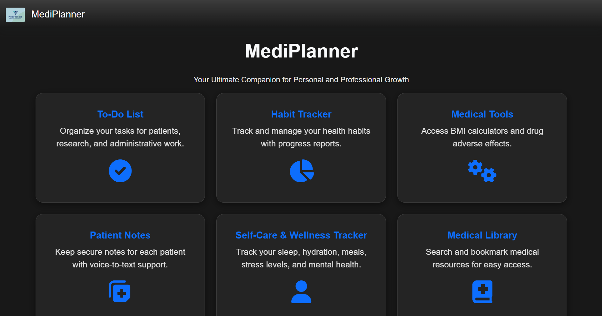
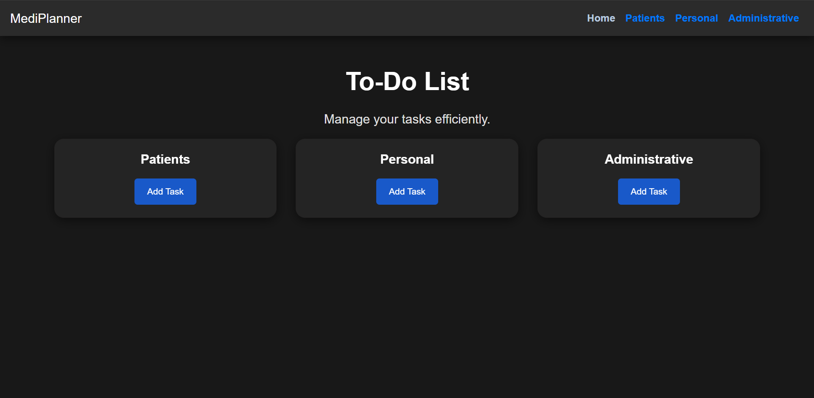
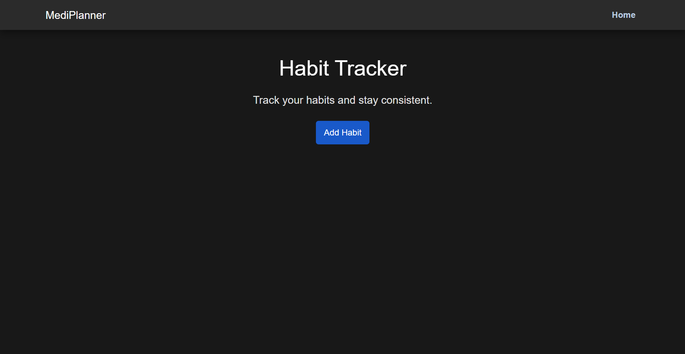
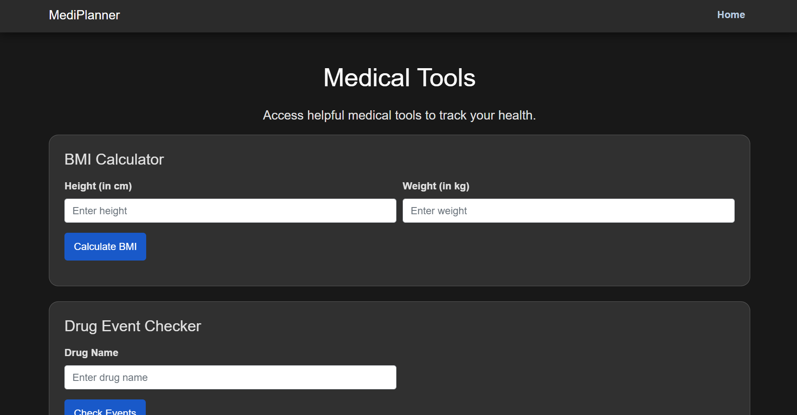
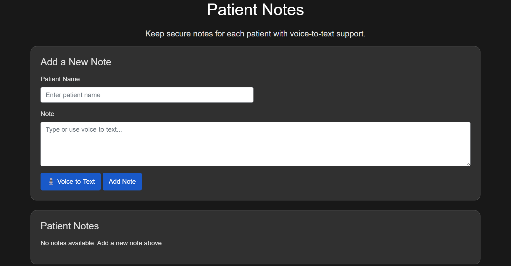
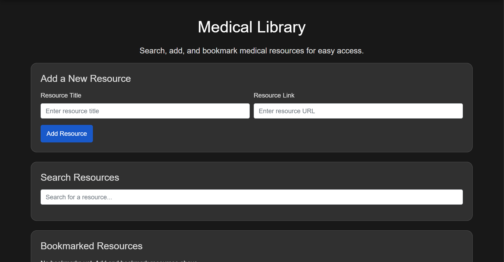
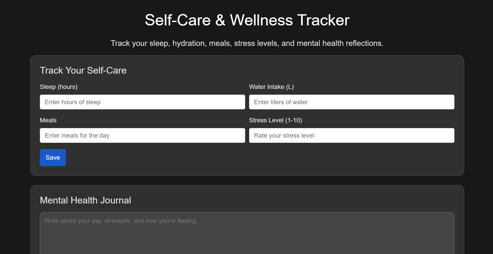

# MediPlanner

**MediPlanner** is a comprehensive tool designed to assist healthcare professionals in managing their daily tasks, patient notes, wellness, and more. The app includes features such as a To-Do list, Habit Tracker, BMI calculator, Drug Adverse Effects database, Patient Notes with voice-to-text support, and a Medical Library for quick access to essential resources.
### Dashboard

## Features

- **To-Do List**: Manage daily tasks and reminders with ease.
  

- **Habit Tracker**: Track and maintain healthy habits.

- **BMI Calculator**: Calculate and monitor Body Mass Index for patients.
- **Drug Adverse Effects**: Access and reference drug adverse effects.

- **Patient Notes**: Secure and easily accessible patient notes with voice-to-text functionality.

- **Medical Library**: Search and bookmark essential medical resources for quick access.

- **Self-Care & Wellness Tracker**: Track personal wellness, hydration, sleep, meals, and stress levels.

## License

This project is licensed under **All Rights Reserved**.

## Disclaimer

This app is designed for use by healthcare professionals to improve their daily workflows. It is not intended for actual clinical decision-making and should be used as a supplementary tool.

